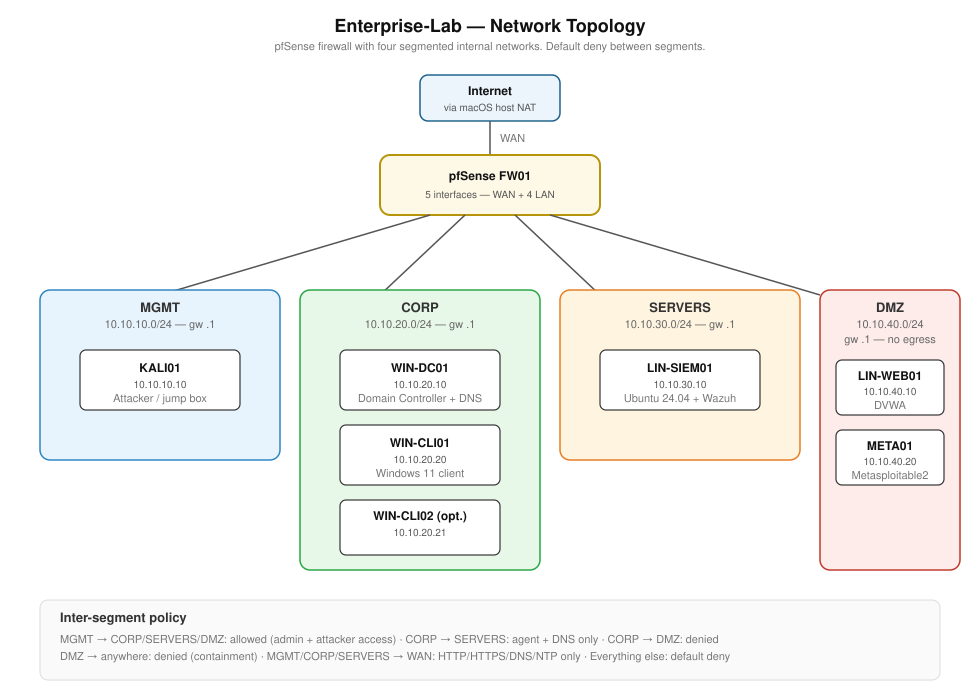

# Enterprise-Lab

A documented home lab simulating a small enterprise network, built from scratch on VMware Fusion. Used for hands-on Security+ study and entry-level cybersecurity skill building.

> **Status:** In progress. Building publicly in 10 sessions.

## What this is

A segmented enterprise network with a firewall, Active Directory domain, Linux server, SIEM, IDS, vulnerable targets, and an attacker workstation. Every component is installed, configured, and documented step by step with screenshots, so the build can be reproduced and the reasoning behind each design choice is visible.

## Why I built it

I'm transitioning from telecoms into IT and cybersecurity. The fastest way to demonstrate hands-on capability — rather than just listing certifications — is to build a realistic environment, break it, defend it, and write about it publicly.

This repo is part lab notebook, part portfolio.

## Network topology



Four internal segments behind a pfSense firewall:

| Segment   | Subnet            | Purpose                                              |
| --------- | ----------------- | ---------------------------------------------------- |
| MGMT      | 10.10.10.0/24     | Kali Linux — admin jump box and attacker workstation |
| CORP      | 10.10.20.0/24     | Active Directory domain (DC + Windows 11 clients)    |
| SERVERS   | 10.10.30.0/24     | Ubuntu Server hosting Wazuh SIEM                     |
| DMZ       | 10.10.40.0/24     | Metasploitable2 and DVWA — vulnerable targets        |

Inter-segment traffic is denied by default. Allow rules are explicit and documented.

## Build log

| # | Session                              | Status        |
|---|--------------------------------------|---------------|
| 1 | Prep & planning                      | Complete      |
| 2 | VMware Fusion custom networking      | Complete      |
| 3 | pfSense install & firewall rules     | Complete      |
| 4 | Active Directory build               | Complete      |
| 5 | Domain clients & GPOs                | Not started   |
| 6 | Ubuntu Server + Wazuh SIEM           | Not started   |
| 7 | Vulnerable targets in DMZ            | Not started   |
| 8 | Suricata IDS + pfBlockerNG threat intel | Not started |
| 9 | Kali attack box                      | Not started   |
| 10 | Detection scenarios + v1 polish     | Not started   |

Each session's writeup is in [`docs/`](docs/).

## Tooling

- **Hypervisor:** VMware Fusion 13.6.4 (Pro, free for personal use)
- **Firewall:** pfSense CE
- **Domain:** Windows Server 2022 (180-day evaluation)
- **Endpoints:** Windows 11 Enterprise (90-day evaluation)
- **Linux server:** Ubuntu Server 24.04 LTS
- **SIEM:** Wazuh (single-node)
- **IDS:** Suricata
- **Attacker box:** Kali Linux
- **Vulnerable targets:** Metasploitable2, DVWA

## Repo layout

```
Enterprise-Lab/
├── README.md                  this file
├── docs/                      step-by-step session writeups
├── diagrams/                  network and architecture diagrams
├── screenshots/               session screenshots, one folder per session
├── configs/                   exported configs (sanitised)
└── scenarios/                 attack/detect exercises and their writeups
```

## About me

I'm Luke, transitioning into IT and cybersecurity from a 5-year telecoms background. Currently studying CompTIA Security+ (A+ completed Dec 2025). Based in London.

GitHub: [@lukeanwar](https://github.com/lukeanwar)
